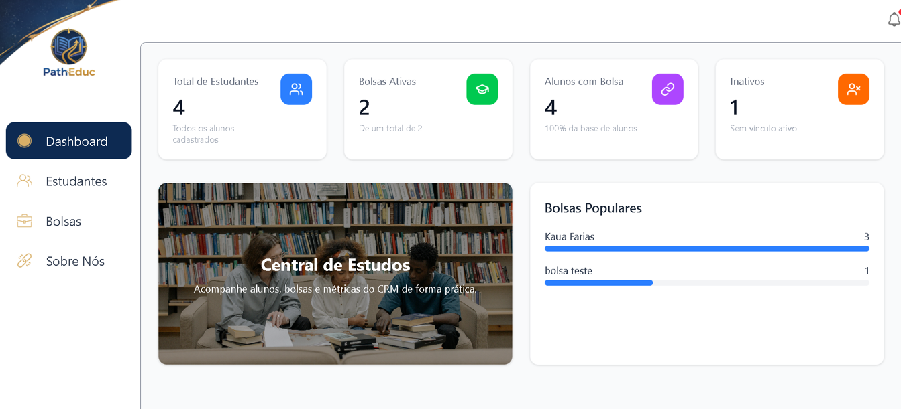

🚀 CRM de Estudantes e Bolsas

Frontend: React + TypeScript + Vite + TailwindCSS

✨ Uma aplicação moderna e elegante para gerenciamento de estudantes e controle de bolsas, oferecendo uma interface intuitiva, responsiva e rápida.

📋 Visão Geral

Uma aplicação React moderna que permite gerenciar estudantes, acompanhar seu status e verificar se possuem bolsas, com uma experiência de usuário intuitiva e otimizada para desktops e dispositivos móveis.

✨ Principais Funcionalidades

⚡ Status do Estudante: Ativar ou inativar estudantes diretamente do card.

🎯 Visualização de Bolsas: Identificação rápida de quais estudantes possuem bolsa.

📝 Cadastro e Edição: Formulário para criar ou editar estudantes.

🗑️ Exclusão: Remover estudantes com um clique.

🚀 Interface Responsiva: Funciona perfeitamente em diferentes tamanhos de tela.

🎨 UI Clean e Intuitiva: Cards com informações claras e ícones interativos para ações.

🛠️ Tecnologias

React – Biblioteca para construção de interfaces dinâmicas.

TypeScript – Tipagem estática para segurança e melhor manutenção do código.

Vite – Build tool ultrarrápido com desenvolvimento otimizado.

TailwindCSS – Framework utilitário para estilização moderna e consistente.

Axios – Para requisições HTTP ao backend.

React Router – Navegação entre páginas.

React Icons – Ícones para ações de edição e exclusão.

🚀 Como Executar Localmente
📋 Pré-requisitos

Certifique-se de ter instalado:

Node.js v16.0.0 ou superior

npm v7.0.0 ou superior

Verifique as versões:

node --version   # v18.x.x
npm --version    # v9.x.x

📥 Instalação

1️⃣ Clone o repositório:

git clone <url-do-repositorio>
cd crm-frontend

2️⃣ Instale as dependências:

npm install

▶️ Executando o Projeto

Inicie o servidor de desenvolvimento:

npm run dev

A aplicação estará disponível em:

http://localhost:5173

📦 Scripts Disponíveis

| Comando           | Descrição              | Uso                   |
| ----------------- | ---------------------- | --------------------- |
| `npm run dev`     | 🔄 Dev com hot reload  | Desenvolvimento local |
| `npm run build`   | 📦 Build para produção | Deploy em servidor    |
| `npm run preview` | 👀 Visualiza a build   | Teste antes de deploy |
| `npm run lint`    | ✅ Verifica código      | Qualidade de código   |

📁 Estrutura do Projeto

crm-frontend/
│
├── src/
│   ├── components/          # Componentes Reutilizáveis (CardEstudante, FormEstudante)
│   ├── pages/               # Páginas (ListarEstudantes, EditarEstudante, DeletarEstudante)
│   ├── models/              # Tipos/Interfaces (Estudante.ts, Bolsa.ts)
│   ├── services/            # Serviços de API (Axios)
│   ├── assets/              # Recursos estáticos (imagens, avatares)
│   ├── utils/               # Funções utilitárias (ToastAlerta)
│   ├── App.tsx              # Componente raiz
│   ├── main.tsx             # Ponto de entrada
│   └── index.css / App.css  # Estilos globais
│
├── public/                  # Arquivos públicos
├── package.json             # Dependências
├── vite.config.ts           # Configuração Vite
├── tsconfig.json            # Configuração TypeScript
└── README.md                # Este arquivo

💡 Boas Práticas

✅ Componentes devem usar PascalCase (CardEstudante.tsx)

✅ Utilize TypeScript para melhor tipagem

✅ Mantenha componentes pequenos e focados

✅ Use Tailwind CSS para consistência

✅ Siga as regras do ESLint

✅ Exportações nomeadas para melhor importação

🔧 Configurações Importantes
Tailwind CSS

Estilos aplicados via classes utilitárias. Configure tailwind.config.js conforme necessidade do projeto.

TypeScript

Projeto em strict mode. Sempre adicione tipos para funções, props e variáveis.

ESLint

Use npm run lint regularmente para manter a qualidade do código.

📄 Licença

Este projeto está licenciado sob a MIT License – veja o arquivo LICENSE
 para detalhes.

👩‍💻 Equipe de Desenvolvimento

Este projeto foi desenvolvido pelo Grupo 4 da Turma JavaScript 10:

Gabrieli Martins – Membro

Kauã Gabriel de Farias – Membro

Assis Pires Neto – Membro

Lilia – Membro

Patrícia Souza – Membro

Pedro – Membro

